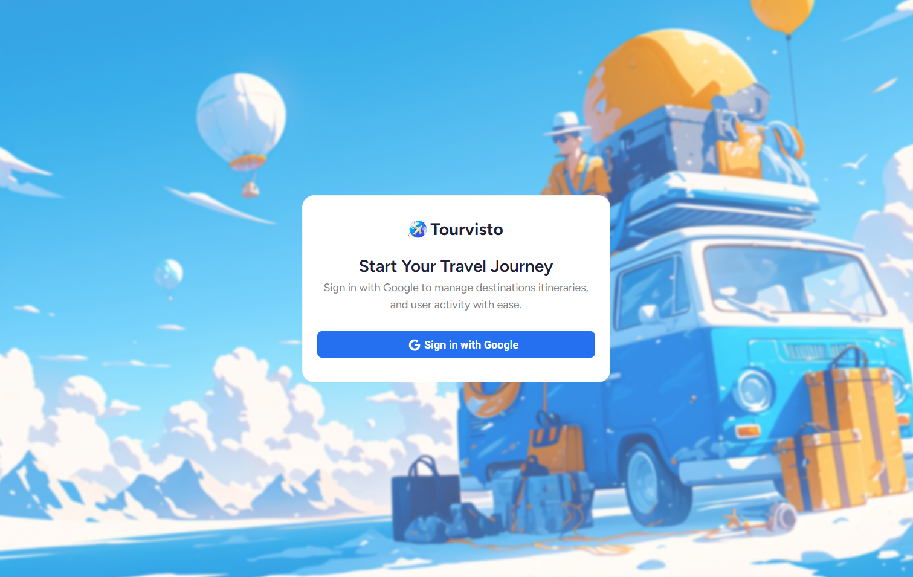
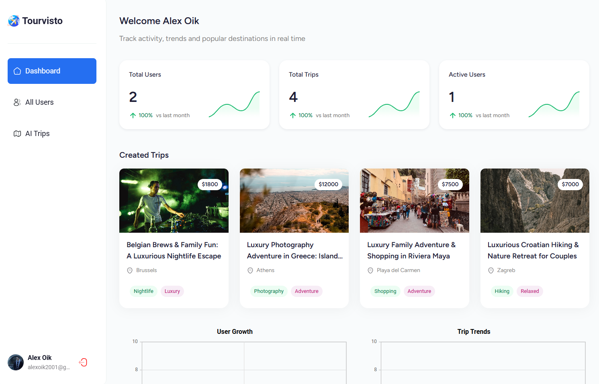
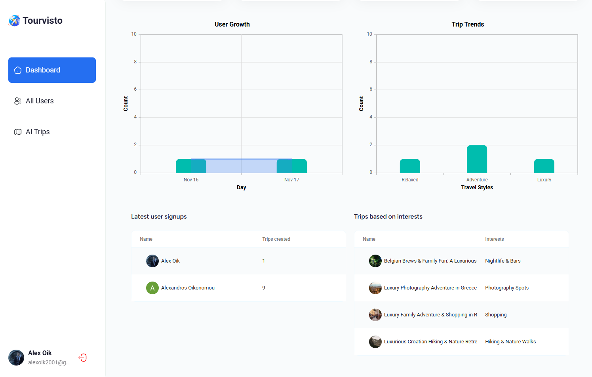
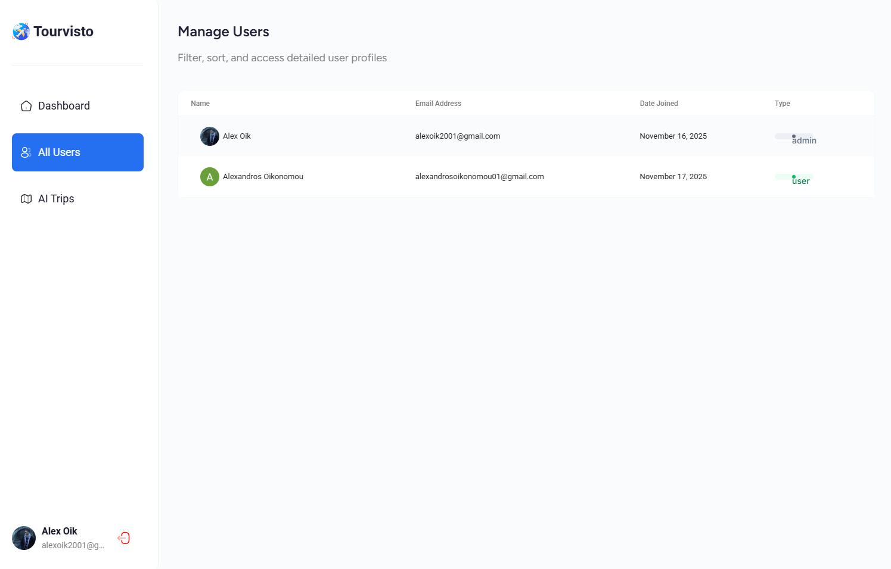
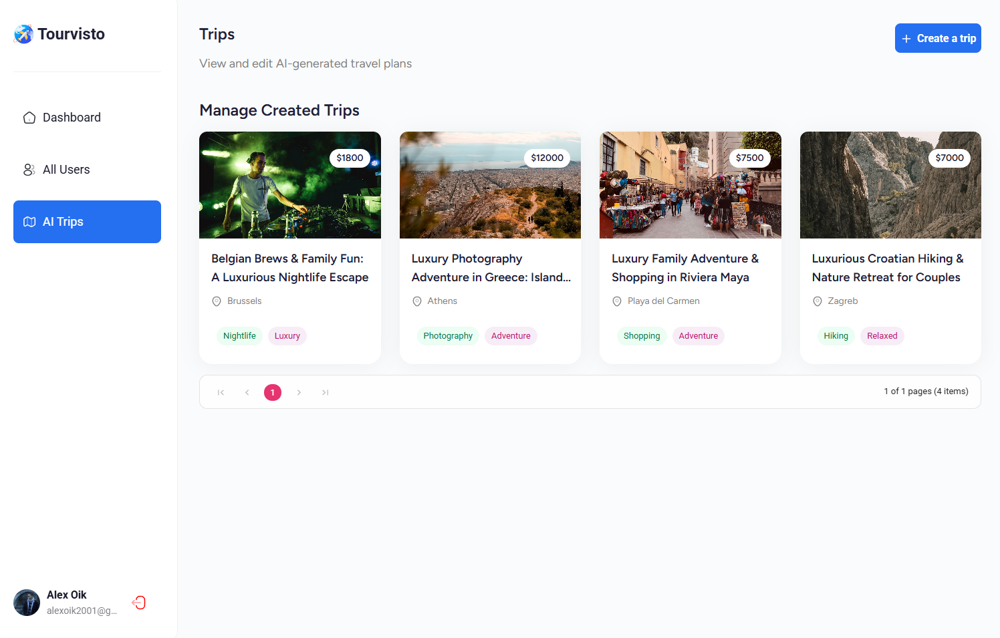
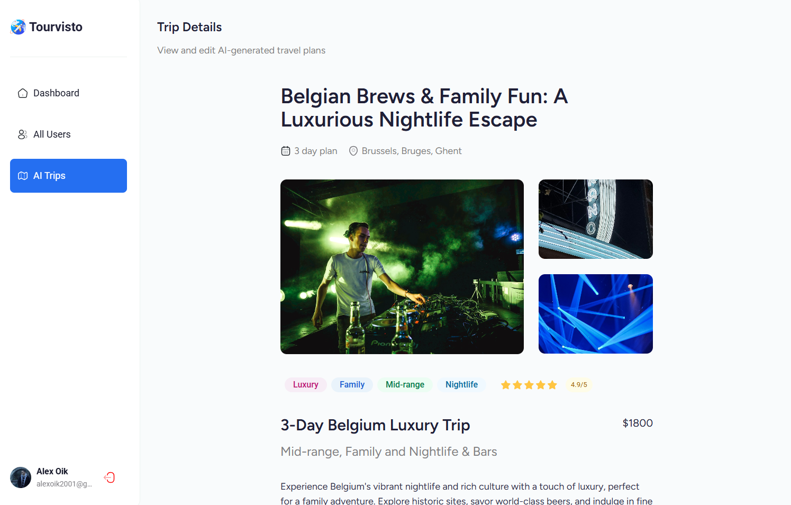
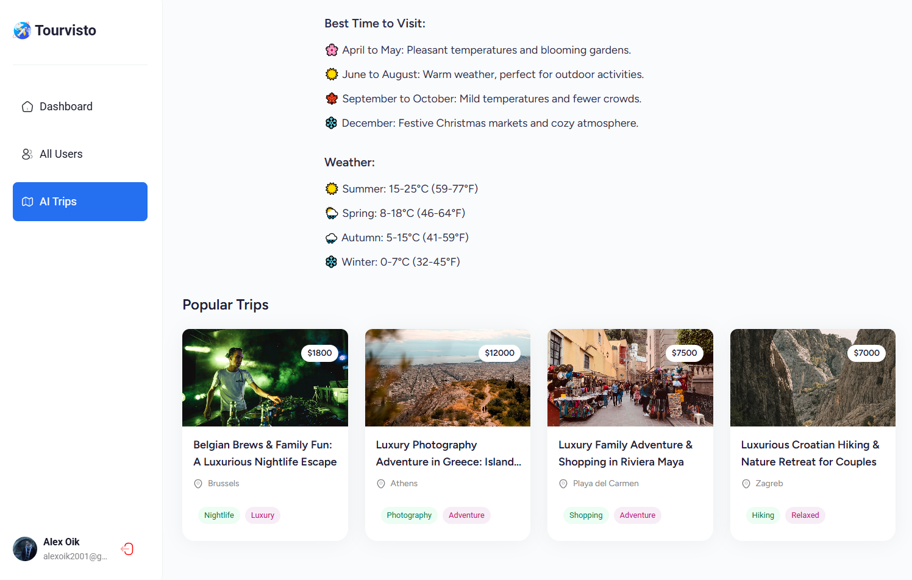
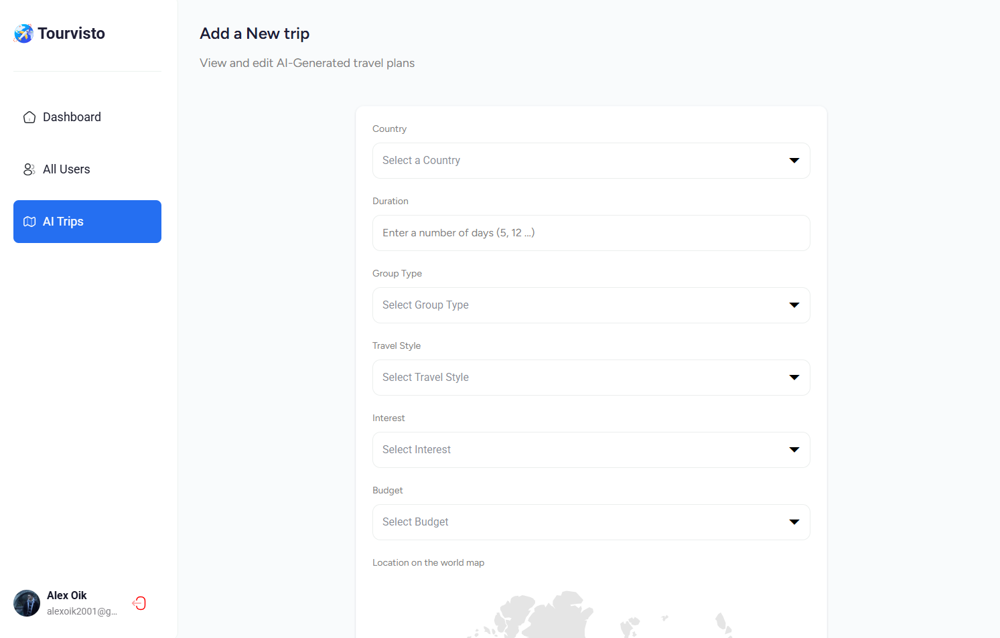
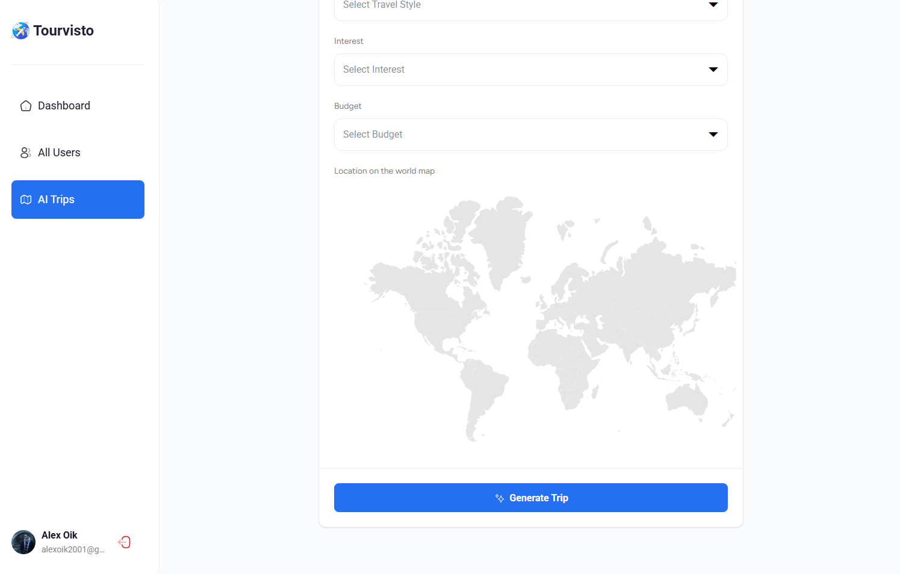

# Travel Agency

## About App

**Description:**

A modern, AI-enhanced dashboard built for travel agencies to manage destinations, bookings, customers, analytics, and AI-powered assistance.
Developed using React, React Router v7, Syncfusion UI, Appwrite backend, and Gemini AI.

**Tech Stack:**

| Category         | Technology                                                        |
| ---------------- | ----------------------------------------------------------------- |
| Frontend         | React, React Router v7                                            |
| UI Components    | Syncfusion                                                        |
| Backend          | Appwrite (Database, Auth, Storage, Functions)                     |
| AI               | Google Gemini API                                                 |

## Installation & Development Setup

Clone, Install, and Run the Project:

```bash
# Clone the repository
git clone https://github.com/alexoiik/travel-agency.git

# Move into the project directory
cd travel-agency

# Install dependencies
npm install

# Run the development server
npm run dev

```

## User Interface (UI)

 <br/>
 <br/>
 <br/>
 <br/>
 <br/>
